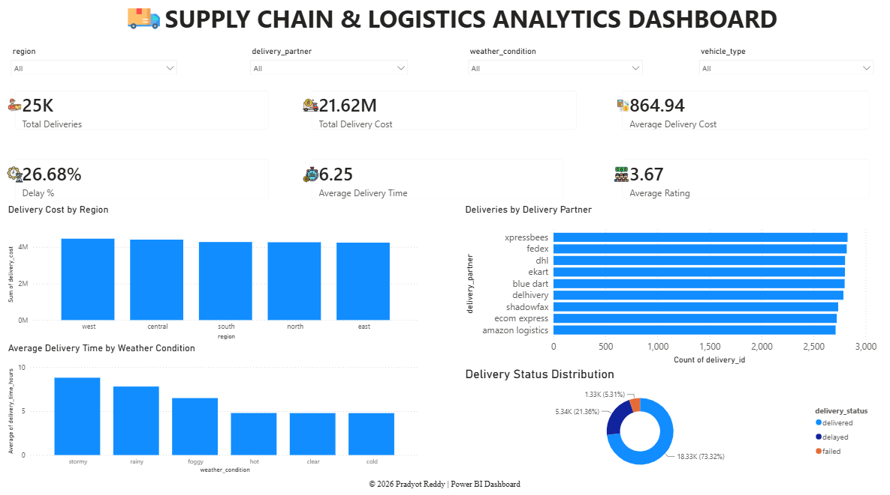
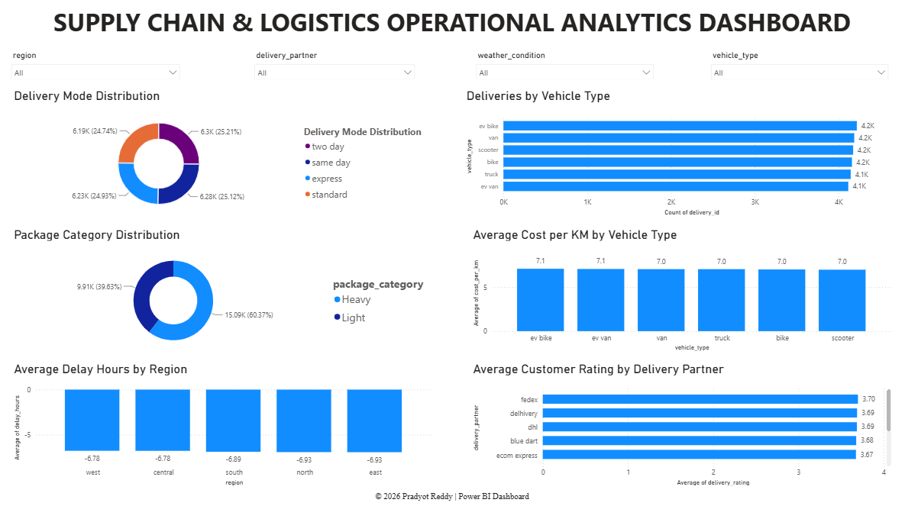
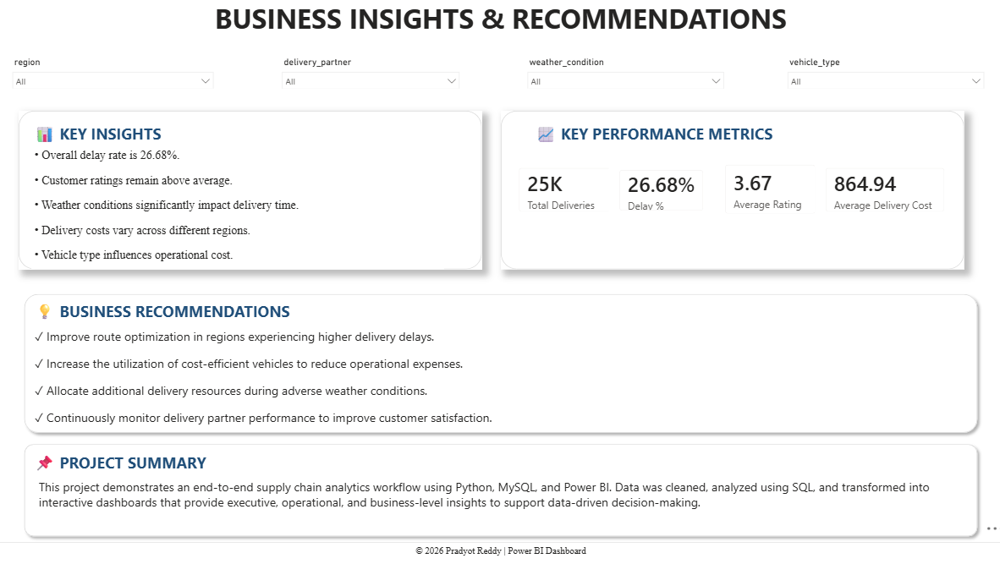

# 🚚 Supply Chain & Logistics Analytics

> An end-to-end data analytics project analyzing delivery operations, costs, delays, vehicle performance, customer ratings, and regional logistics performance using **Python, SQL, and Power BI**.

---

## 📊 Project Overview

This project focuses on analyzing supply chain and logistics delivery data to identify operational trends, cost patterns, delivery delays, and performance variations across regions, delivery partners, vehicles, weather conditions, and package categories.

The project follows an end-to-end analytics workflow:

**Raw Data → Python Data Cleaning → SQL Analysis → Power BI → Business Insights**

---

## 🎯 Objectives

- Analyze overall delivery performance.
- Identify factors contributing to delivery delays.
- Analyze delivery costs across regions and vehicles.
- Compare delivery partner performance.
- Understand the impact of weather conditions on delivery time.
- Analyze vehicle and delivery mode utilization.
- Monitor customer delivery ratings.
- Build interactive dashboards for business decision-making.

---

## 🛠️ Tech Stack

| Technology | Purpose |
|---|---|
| 🐍 Python | Data cleaning and preprocessing |
| 🗄️ SQL | Data analysis and querying |
| 📊 Power BI | Interactive dashboards and visualization |
| 📐 DAX | KPI calculations and measures |
| 🐼 Pandas | Data manipulation |
| 🔢 NumPy | Numerical operations |

---

## 📁 Project Structure

```text
Supply-Chain-Logistics-Analytics/
│
├── Data/
│   ├── Raw_Dataset.csv
│   └── Cleaned_Dataset.csv
│
├── SQL/
│   └── Supply_Chain_SQL_Analysis.sql
│
├── PowerBI/
│   ├── Supply_Chain_Analytics.pbix
│   └── Supply_Chain_Dashboard.pdf
│
├── Python/
│   └── Supply_Chain_Analytics.ipynb
│
├── Images/
│   ├── Dashboard_Page1.png
│   ├── Dashboard_Page2.png
│   └── Dashboard_Page3.png
│
├── README.md
├── LICENSE
└── .gitignore
```

---

# 📊 Power BI Dashboard

The Power BI report consists of three interactive dashboards designed to provide executive, operational, and business-level insights.

---

## 1️⃣ Executive Dashboard

Provides a high-level overview of delivery performance using KPIs and interactive visualizations.

### Key Metrics

- Total Deliveries
- Total Delivery Cost
- Average Delivery Cost
- Delay Percentage
- Average Delivery Time
- Average Customer Rating

### Dashboard Preview



---

## 2️⃣ Operational Analytics

Focuses on operational performance across delivery modes, vehicle types, package categories, regions, and delivery partners.

### Analysis Includes

- Delivery Mode Distribution
- Deliveries by Vehicle Type
- Package Category Distribution
- Average Cost per KM
- Average Delay by Region
- Average Rating by Delivery Partner

### Dashboard Preview



---

## 3️⃣ Business Insights & Recommendations

Provides key findings, performance metrics, and recommendations based on the analysis.

### Includes

- Key Insights
- Key Performance Metrics
- Business Recommendations
- Project Summary

### Dashboard Preview



---

# 📈 Key Performance Indicators

| KPI | Description |
|---|---|
| Total Deliveries | Total number of deliveries analyzed |
| Total Delivery Cost | Overall delivery expenditure |
| Average Delivery Cost | Average cost per delivery |
| Delay Percentage | Percentage of deliveries marked as delayed |
| Average Delivery Time | Average time taken for deliveries |
| Average Customer Rating | Average customer rating |

---

# 🔄 Project Workflow

```text
                 RAW DATA
                    │
                    ▼
          ┌──────────────────┐
          │ Python Cleaning  │
          │  & Preprocessing  │
          └──────────────────┘
                    │
                    ▼
          ┌──────────────────┐
          │ Cleaned Dataset  │
          └──────────────────┘
                    │
                    ▼
          ┌──────────────────┐
          │   SQL Analysis   │
          └──────────────────┘
                    │
                    ▼
          ┌──────────────────┐
          │    Power BI      │
          │    Data Model    │
          └──────────────────┘
                    │
                    ▼
          ┌──────────────────┐
          │   DAX KPIs &     │
          │     Measures     │
          └──────────────────┘
                    │
                    ▼
          ┌──────────────────┐
          │    Interactive   │
          │     Dashboard    │
          └──────────────────┘
                    │
                    ▼
             BUSINESS INSIGHTS
```

---

# 🔍 Key Analysis Areas

### 🚚 Delivery Performance
Analysis of delivery volume, delivery status, delivery time, and delays.

### 💰 Cost Analysis
Analysis of total delivery cost, average delivery cost, and cost per kilometer.

### 🌦️ Weather Impact
Comparison of delivery performance and delivery time across different weather conditions.

### 🚗 Vehicle Analysis
Analysis of delivery volume and cost across different vehicle types.

### 👥 Delivery Partner Performance
Comparison of delivery partners based on delivery volume and customer ratings.

### 🌎 Regional Analysis
Analysis of delivery costs and delays across different regions.

### 📦 Package Analysis
Analysis of delivery patterns across different package categories.

### ⭐ Customer Satisfaction
Analysis of customer ratings to understand delivery service performance.

---

# 💡 Business Recommendations

The analysis can help businesses:

- Identify regions with higher delivery delays.
- Monitor delivery partner performance.
- Analyze transportation and delivery costs.
- Improve vehicle utilization.
- Understand the effect of weather conditions on delivery time.
- Monitor customer satisfaction through delivery ratings.
- Identify opportunities to improve operational efficiency.
- Optimize logistics planning based on historical delivery patterns.

---

# 🚀 Future Improvements

- Real-time delivery tracking
- Predictive delivery-delay analysis
- Demand forecasting
- Machine learning-based delivery time prediction
- Automated Power BI data refresh
- Live GPS and logistics monitoring
- Advanced route optimization

---

# 📂 Project Components

### Python

The Python notebook is used for data cleaning and preprocessing before analysis.

### SQL

SQL is used for querying the dataset and performing analytical operations.

### Power BI

Power BI is used to create interactive dashboards, KPIs, filters, and visualizations.

### DAX

DAX measures are used to calculate important performance indicators and support dynamic dashboard analysis.

---

# 👨‍💻 Author

**Pradyot Reddy**

Computer Science & Engineering  
Sreenidhi Institute of Science and Technology

---

## ⭐ Project

If you found this project useful or interesting, consider giving the repository a ⭐.
